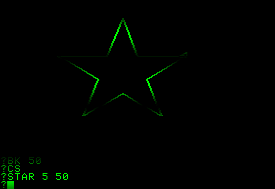
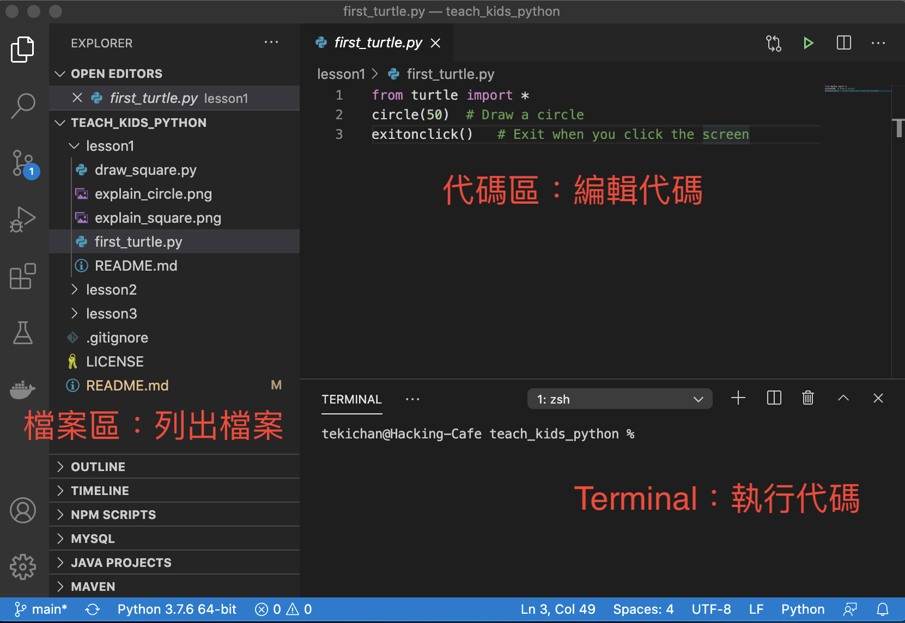

# Teach Kids Python in Cantonese
[](/LICENSE) 

這是一個關於教導兒童Python編程的項目庫。我希望這個項目可以為主要以廣東話為母語的小朋友開啟既簡單又有趣的Python編程教學。 

## 目錄
- [簡介](#intro)
- [安裝軟件](#install)
- [第一課：基本編程概念](/lesson1/)
- [第二課：變量](/lesson2/)
- [第三課：條件](/lesson3/)
- [第四課：for循環](/lesson4/)
- [第五課：while循環](/lesson5/)
- [第六課：函數]

<a name="intro"></a>

## 簡介
現今STEM教育普及，兒童導向的編程教學種類繁多。當中圖象化的Block-based Programming，如[Scratch](https://scratch.mit.edu/)、[MIT App Inventor](https://appinventor.mit.edu/)等，可以讓沒有編程經驗的兒童窺探編程的技巧。如果下一步想接觸切實的編程語言的話，理所當然選擇語法簡易明白，且用途廣泛實用的編程語言。

芸芸選擇當中，Python正正符合這方面的教學要求。它的好處包括
- 語法簡易，沒有冗長的語句，也不用預先編譯(compile)而直接運行。十分適合初學者，尤其兒童
- 可以在多個平台運行，如Windows、Linux及MacOS。大部分電腦也可以執行你的編程作品
- 用途廣泛，包括網站後台、數據分析，人工智能等等。日後必能學以致用

然而，跟其它編程語言一樣，初階教學一般使用命令行介面(Command-Line Interface)，例如打印[Hello World](https://zh.wikipedia.org/wiki/Hello_World)。只有文字的輸出對於小朋友來說可能顯得乏味。幸好，Python有一個名叫**turtle**的模組，參照一個以前也是初學者導向的繪圖語言[LOGO](https://zh.wikipedia.org/wiki/Logo_(%E7%A8%8B%E5%BA%8F%E8%AF%AD%E8%A8%80))，讓小朋友學會使用Python繪畫繞有趣味的圖象。



（上圖為二十世紀舊式電腦執行LOGO編程繪圖的畫面）

其實，教導兒童Python的材料在網上多不勝數，當中不乏英語及國語的講學，而廣東話的卻寥寥可數。有見及此，我嘗試在此拋磚引玉。一方面，以廣東話為母語的小朋友可以初嘗真實編寫程的趣味及滿足感；另一方面，希望可以引發各位教育工作者的興趣和注意，鼓勵製作更多更專業的Python編程教材。

<a name="install"></a>

### 安裝軟件
我聽到不少家長的意見，不知如何開始學習Python，因為Python或其它實際的編程語言，從編程、除錯、執行等部驟都需要編程員親自處理，不像Scratch等學習平台已經預備好工作環境，所以好點兒老鼠拉龜。工欲善其事，必先利其器。好的工具確實可以讓工作事半功倍。現附上[視頻簡介如何打造適合新手的開發環境](https://youtu.be/v0MixbRW2k8)。

[](https://youtu.be/v0MixbRW2k8)

前往Python官方網站[https://www.python.org/](https://www.python.org/)，下載適合自己電腦作業系統（Windows、Linux或MacOS）的版本。本教學是使用Python 3的，選擇最新版本就可以了。

至於編輯器，最基本的話，在Windows可使用**筆記本（Notepad）**或在Mac可使用**TextEdit**。不過，我會強烈建議安裝編程專用的編輯器，可以為自己省卻不少後續功夫。本課程中，我會使用Visual Studio Code。你可以到[https://code.visualstudio.com/](https://code.visualstudio.com/)，下載適合自己電腦作業系統的版本。

執行Python的時候，我們須要輸入指令運行**python3**執行檔。在Windows，可使用「命令提示字元」（CMD）或在MacOS，可使用「Terminal」。不過，最方便的方法是你已經安裝了Visual Studio Code，在菜單上選擇Terminal，再選擇New Terminal便可以開啟TERMINAL視窗來輸入執行Python執行檔。



（上圖為Visual Studio Code簡介）

假如你儲存代碼至`my_python.py`，你便可以在Windows的「命令提示字元」或Visual Studio Code的Terminal執行：
```cmd
python3.exe my_python.py
```

MacOS的用戶，可以在「Terminal」或Visual Studio Code的Terminal執行：
```zsh
python3 my_python.py
```

### 聯絡作者
- Teki Chan *tekichan@gmail.com*