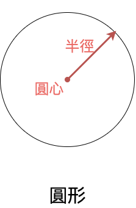
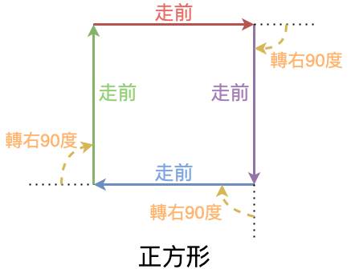

# 第一課：基本編程概念

[第一課的視頻](https://youtu.be/Yf94am_VaUo)：

[](https://youtu.be/Yf94am_VaUo)

本課是介紹基本編程概念。編程就是編寫程序，通過電腦可以理解的文字，按照既定的運算方式，執行我們給予電腦的指示。這課的第一個例子就是叫電腦繪畫一個圓形：
```python
circle(50)
```
指令是編程語言最基本的單位。Python的直譯器（interpreter）直譯這個指令便可以繪畫一個半徑為50單位的圓形。



你也可以嘗試直譯本課的代碼[**first_turtle.py**](/lesson1/first_turtle.py)。除了上述畫圓的指令，還有另外兩行代碼，它們會在以後的代碼中都會出現。其解釋如下：
```python
from turtle import *
# 引入turtle程式庫，讓我們可以使用繪畫的功能
# 本課程的代碼都會以此開始

circle(50)
# 畫圓的指令

exitonclick()
# 讓我們可以點擊離開程式
# 本課程的代碼都會以此終結
```

使用Windows的話，在終端機中先到代碼檔案的目錄，然後執行`python3.exe first_turtle.py`；而使用MacOS的話，在終端機中先到代碼檔案的目錄，然後執行`python3 first_turtle.py`。當中`python3.exe`或`python3`就是Python直譯器的執行檔，`first_turtle.py`是Python程序的代碼檔，以 **.py** 結尾，我們編寫的代碼便放在這個檔案裡。

不過，電腦不是人腦，它不能好像人類一樣直接理解複雜的命令。你可以用 `circle()` 指示Python畫圓形，也可以用 `forward()` 畫直線，但是Python卻不能理解如何畫正方形。我們須要教導Python如何用直線繪畫正方形。把**畫正方形**這項大問題分拆成多項它能理解的小指令，讓各小指令的結果組合成大問題的解決方法，便是編程的工作。

畫正方形可以由以下的指令完成：
```python
forward(50)     # 向前行50步來畫一條邊
right(90)       # 轉右90度（即是直角）
forward(50)     # 再向前行50步來畫一條邊
right(90)       # 轉右90度
forward(50)     # 再向前行50步來畫一條邊
right(90)       # 轉右90度
forward(50)     # 再向前行50步來畫最後一條邊
```
當中 **forward()** 是叫箭頭向前的指令； **right()** 是向右的指令； **#** 後的是注釋，方便編程者提醒自己或向其它人解釋當中的意思。



## 挑戰題

瀏覽官方網頁[https://docs.python.org/3.9/library/turtle.html](https://docs.python.org/3.9/library/turtle.html)，抽取幾個關於turtle的操作方法，例如：home()、bgcolor()等，嘗試加入到自己的python代碼，並執行一下，看看有什麼結果？
