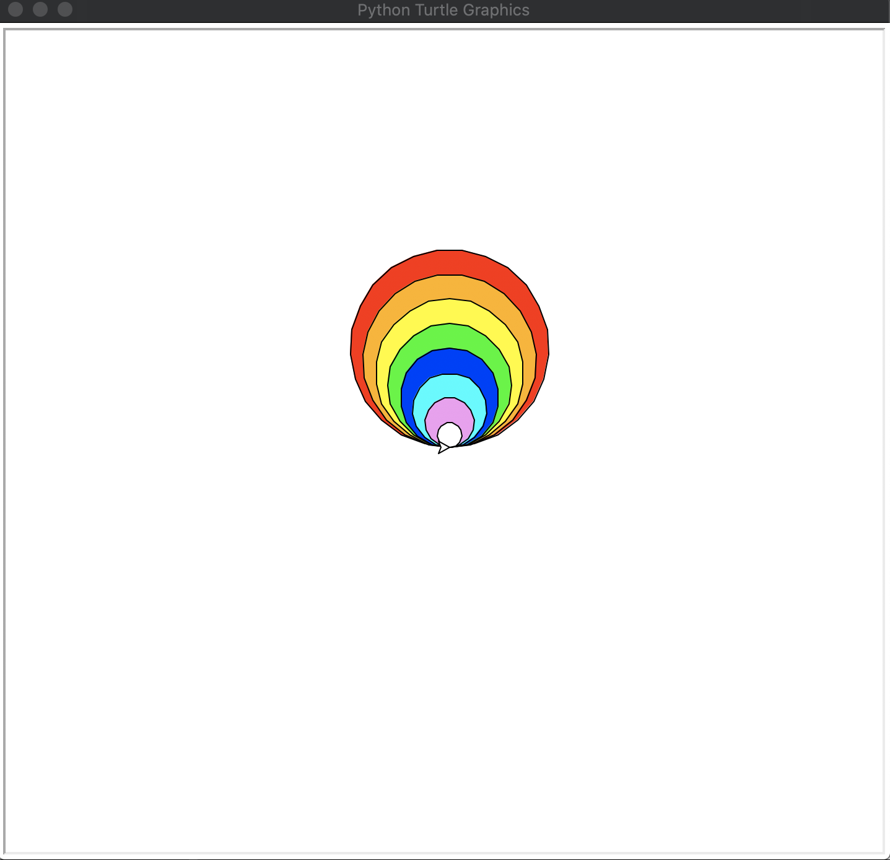

# 第七課：陣列
[第二課：變量](/lesson2/)提及電腦儲存數據於變量中。如果我們需要儲存多項相關數據，例如：一系列圓形的半徑，如果創建多個變量的話，不但處理多個變量會很麻煩，而且未能充分使用電腦的計算資源。因此，編程中不同的數據結構(Data Structure)便應運而生。不同種類的數據結構適合不同種類的應用，恰當的數據結構更可以提高編程演算法的效率。本課將會介紹其中一種：陣列(Array)。

陣列是由一系列元素(Element)的集合所組成的數據結構。每個元素在陣列中是依次序的，並可以利用索引(Index)提取。在Python中，陣列可以選擇使用可改變元素的列表(List)或不可改變元素的元組(Tuple)。

```python
my_list = [1, 3, 5, 7, 9]   # create a list
print(my_list[2])   # Display 5
my_tuple = (2, 4, 6, 8, 10) # create a tuple
print(my_tuple[3])   # Display 8
```
在以上的例子，第一行的列表`my_list`儲存了五個不同的值。而第二行則利用索引提取第三個元素，並顯示出來。因為Python的索引是以0開頭，第一個元素的索引是0，第二個是1，如此類推。

提取陣列的元素，我們通常會配合循環使用，包括[第四課：for循環](/lesson4/)與[第五課：while循環](/lesson5/)。

```python
my_list = [1, 2, 3, 4, 5]   # create a list
loop_index = 0  # initiate the index from 0
while loop_index < len(my_list):
    # len() is a function to return the length of the inputted list
    is_even = my_list[loop_index] % 2 == 0      # % is a remainder operator
    if is_even:
        print(str(my_list[loop_index]) + ' is EVEN.')
    else:
        print(str(my_list[loop_index]) + ' is ODD.')
    loop_index += 1     # Increase loop_index by 1 at the end of each loop
"""
Output is:
1 is ODD.
2 is EVEN.
3 is ODD.
4 is EVEN.
5 is ODD.
"""
```
以上是用while循環的例子，判斷一系列的數是單數或雙數。首先創建列表`my_list`及起始索引變量`loop_index`。然後進入while循環。while循環的條件是當`loop_index`小於`my_list`的長度，而`my_list`的長度可以用`len(my_list)`來獲取。在每次循環中，每個元素會用`my_list[loop_index]`來取得，並用` % 2`來計算該元素除以2的餘數，用` == 0`來判斷該餘數是否等於0（除以2的餘數等於0就是雙數，否則是單數）。

```python
side_list = [1, 2, 3, 4, 5]   # create a list
for side in side_list:
    # an element is put to a variable side in each loop
    area = side * side
    print('Length of square Side: ' + str(side) + ', area of square: ' + str(area))
"""
Output is:
Length of square Side: 1, area of square: 1
Length of square Side: 2, area of square: 4
Length of square Side: 3, area of square: 9
Length of square Side: 4, area of square: 16
Length of square Side: 5, area of square: 25
"""
```
以上是用for循環的例子，計算一系列正方形邊長的面積。首先創建列表`side_list`來儲存一系列正方形邊長，然後就進入for循環。在每次循環中，順序抽出一個元素，並放進變量`side`。接著，以`area = side * side`計算正方形的面積，並顯示出來。


本課的例子[**draw_rainbow_circles.py**](/lesson7/draw_rainbow_circles.py)是利用陣列來繪畫彩虹。只需要三個部驟：
1. 創建列表`radii_colors_list`，每個元素是一個元組，每個元組分別儲存圓形半徑和圓形的顏色。
2. 開始for循環，每個元素放入變量`radius_color`之中。
3. 利用索引，以`radius_color[1]`來取得第二個元組元素，即是顏色；以`radius_color[0]`來取得第一個元組元素，即是圓形半徑。利用該值繪畫該半徑的圓形並以顏色來填滿顏。